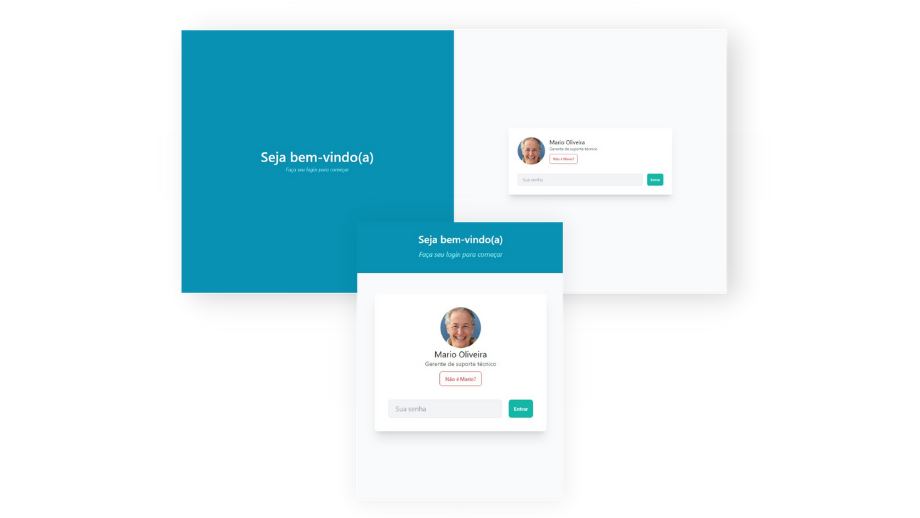

# Página de Login

> 💬 Uma página de login responsiva e elegante.

## Projeto ⭐
***Preview devices***  
  
🚀 [Acesse o site aqui!](https://allbertuu.github.io/pagina-login/) 🚀  

## Tecnologias usadas 💻
- HTML
- CSS
- JavaScript
- SCSS
- TailwindCSS